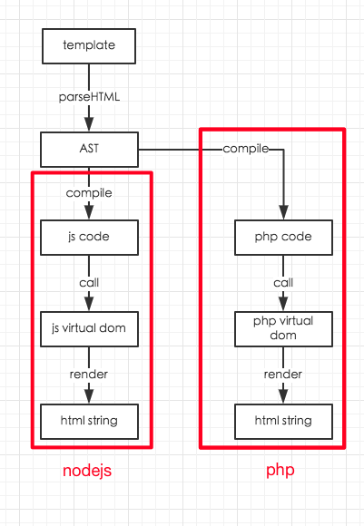

# vue-php

使用php进行vue的服务端渲染方案

## 本地运行

``` shell
$ git clone git@github.com:Joe3Ray/vue-php.git
$ cd vue-php
$ npm install
$ npm run build
$ npm test
```

## 项目文件说明

- `index.js`: 将`.vue`编译成`.js`和`.php`的脚本，编译出来的`.js`用于前端渲染，`.php`用于服务端的渲染
- `build.js`: 批量将`components`中的各个组件调用`index.js`来编译的脚本
- `VNode.php`: 使用php实现的`virtual dom`类
- `Vue_Base.php`: 使用php实现的Vue基类，只包含渲染功能
- `index.php`: 调用php版的Vue组件class渲染出html字符串的示例
- `test.js`: 单元测试脚本
- `componenets/**`: 组件示例
- `vue-template-php-compiler`: 根据`vue-template-compiler`修改而来，能够编译出php版本`render`函数的工具

## Vue服务端渲染原理



## 使用限制

由于不同语言的限制，我们在使用`vue-php`进行服务端渲染时也有一些限制：

- `.vue`文件中，组件的`data`和`components`属性必须单独放到`<config>`中，并且是`json`形式
- `template`中模板使用js表达式时，不能调用函数

## 接入

如果想要接入这一套`vue-php`的方案，需要在线下使用`index.js`对`.vue`文件进行编译，将编译出来的`.php`上线到服务器，并且服务器端引入`VNode.php`和`Vue_Base.php`

## License

[MIT](https://opensource.org/licenses/MIT)